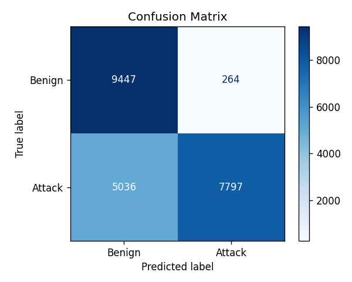
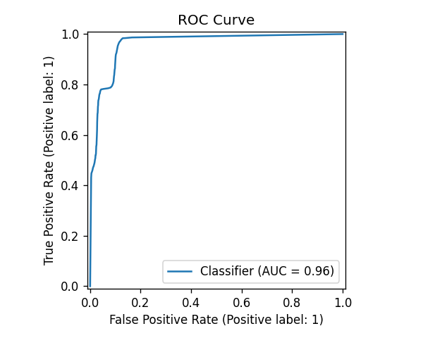
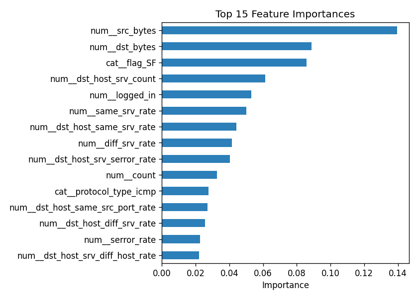

# Oppenheimer — AI Network Intrusion Detection & Automated Response

[](https://github.com/NixonWahome/Oppenheimermode-/actions)


> Named after the film *Oppenheimer* — a system built to detect a threat the
> moment it appears and decide, in real time, whether to act on it.

A SOC-oriented intrusion detection system that learns to distinguish malicious
network flows from benign traffic, then **automatically responds** to threats by
blocking source IPs and logging events to a SIEM. Built on the **NSL-KDD**
benchmark dataset with a reproducible, tested ML pipeline.

> **Why this exists:** demonstrate an end-to-end security ML workflow — labeled
> data → preprocessing → model training & honest evaluation → automated
> detection & response → SIEM logging — the same loop a real SOC detection
> engineer builds and operates.

---

## Architecture

```
 Live NIC ─▶ flow.py ─┐
 (scapy)   reconstruct │   ┌──────────────┐     ┌─────────────────┐     ┌───────────────┐
           features    ├──▶│ Preprocessing │ ─▶ │  Random Forest   │ ─▶ │  Threat score  │
 NSL-KDD flows ────────┘   │ scale+one-hot │     │   classifier     │     │   (0.0–1.0)   │
 (train / replay)          └──────────────┘     └─────────────────┘     └───────┬───────┘
                                                                                 │ score ≥ threshold
                                          ┌──────────────────────────────────────┴───────┐
                                          ▼                                                ▼
                                  ┌────────────────┐                          ┌──────────────────┐
                                  │ FirewallManager │  block src IP            │  SIEM (Elastic)  │
                                  │ iptables/netsh  │ ─────────────────────────▶│  threat events   │
                                  └────────────────┘                          └──────────────────┘
```

The model accepts flows from **two sources**: NSL-KDD records (for training and
the offline demo) and **live traffic** reconstructed from packets captured off a
real interface.

Preprocessing and the classifier are bundled in a single scikit-learn
`Pipeline`, so the exact transformations used in training are reused at
inference time — no train/serve skew.

## Results

Trained on `KDDTrain+` (125,973 flows) and evaluated on the held-out
`KDDTest+` split (22,544 flows). Metrics and plots are regenerated on every
training run into `artifacts/`.

| Metric | Score |
|--------|-------|
| ROC-AUC | **0.962** |
| Precision | **0.967** |
| Recall | 0.608 |
| F1 | 0.746 |
| Accuracy | 0.765 |

<p>
  
  
  
</p>

> Accuracy is intentionally **not** the headline metric: benign traffic
> dominates intrusion datasets, so precision/recall/F1 and ROC-AUC tell the
> real story. The class imbalance is handled with `class_weight="balanced"`.
>
> **On the recall figure:** the `KDDTest+` split deliberately contains attack
> types that never appear in training, which is exactly why NSL-KDD is a hard,
> honest benchmark. The high precision (0.97) means almost everything we block
> is a real attack — a deliberate trade-off for an automated-response tool,
> where false positives block legitimate users. ROC-AUC of 0.96 shows the model
> ranks threats well across thresholds.

## Quickstart

```bash
# 1. Install (editable, so the `netsentinel` package is importable)
python -m venv .venv && source .venv/bin/activate   # Windows: .venv\Scripts\activate
pip install -e .

# 2. Get the dataset (NSL-KDD, ~6 MB)
python scripts/download_data.py

# 3. Train + evaluate (writes model and plots to artifacts/)
python -m netsentinel.train

# 4. Run detection on replayed flows (dry-run: nothing touches your firewall)
python -m netsentinel.realtime --source replay --limit 50
```

To actually enforce blocks and log to Elasticsearch:

```bash
python -m netsentinel.realtime --source replay --enforce --siem
```

### Live network capture (real traffic)

The detector can also run against **real traffic sniffed off your network
interface** — this is the connector that lets the model watch a live network
instead of a recording:

```bash
pip install -e .[live]        # installs scapy
# Run as Administrator / root (raw-socket capture is privileged).
# Capture 500 packets on the default interface, dry-run (no blocking):
python -m netsentinel.realtime --source live --count 500
```

How it works: [`live_capture.py`](src/netsentinel/live_capture.py) sniffs
packets and converts each to a lightweight record; [`flow.py`](src/netsentinel/flow.py)
groups them into **connections** and reconstructs the NSL-KDD feature schema the
model expects; each completed connection is scored and, if it crosses the threat
threshold, its **real source IP** is blocked.

> **Honest feature coverage.** Header- and timing-derived features (bytes,
> protocol, service, TCP flags, duration, and the 2-second traffic statistics
> like connection `count`/`srv_count`/error rates) are computed for real from
> live packets. NSL-KDD's *content* features (e.g. `num_failed_logins`, `hot`)
> require deep payload inspection and are out of scope, so they default to 0.
> The features the model relies on most (see the importance plot) are the ones
> reconstructed live, so live scoring stays meaningful — but this is an
> approximation of the original dataset's labeling environment, not a
> drop-in replacement for it.

### Docker

```bash
docker build -t netsentinel .
docker run --rm netsentinel
```

## How it works

| Module | Responsibility |
|--------|----------------|
| `data.py` | Load NSL-KDD, binarize labels (benign vs. attack), split features |
| `model.py` | Preprocessing + Random Forest pipeline |
| `train.py` | Fit, evaluate, persist model + plots + `metrics.json` |
| `evaluate.py` | Precision/recall/F1/ROC-AUC, confusion matrix, ROC, feature importances |
| `realtime.py` | Score flows (replayed or live) and drive automated response |
| `flow.py` | Reconstruct NSL-KDD connection features from a packet stream |
| `live_capture.py` | Sniff a network interface (scapy) and feed the flow tracker |
| `firewall_manager.py` | Cross-platform IP blocking (dry-run by default) + SIEM logging |

## Testing & CI

```bash
pip install -r requirements-dev.txt
ruff check src tests   # lint
pytest -q              # unit tests (synthetic data, no network needed)
```

GitHub Actions runs lint + tests on every push and pull request.

## Safety & design notes

- **Dry-run by default.** The firewall never modifies the host unless you pass
  `--enforce`. A tool that takes automated action should fail safe.
- **Reproducible.** Fixed random seed; data fetched by script, never committed.
- **Honest evaluation.** Reported on a held-out split with imbalance-aware
  metrics.

## Limitations & roadmap

- **Live feature parity.** The live flow extractor reconstructs the header- and
  timing-based NSL-KDD features but not the payload/content features (which
  default to 0). Closing that gap would need deep packet inspection or a
  CICFlowMeter-style extractor paired with a model trained on the same feature
  set (e.g. CIC-IDS2017).
- Train on a more modern dataset (CIC-IDS2017) with contemporary attack types,
  so the live and training feature sets match exactly.
- Add gradient-boosted trees (XGBoost/LightGBM) as a comparison baseline.
- Stream events to a Grafana/Kibana dashboard.

## License

MIT
